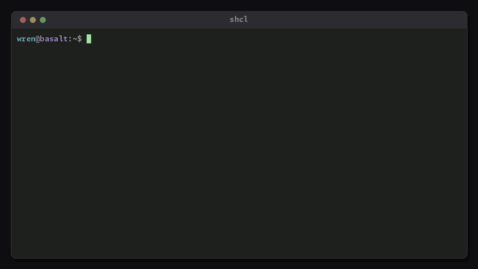

<!-- markdownlint-disable MD007 -- Unordered list indentation -->
<!-- markdownlint-disable MD010 -- hard tabs -->
<!-- markdownlint-disable MD033 -- inline html -->
<!-- markdownlint-disable MD055 -- Table pipe style [Expected: leading_and_trailing; Actual: leading_only; Missing trailing pipe] -->
<!-- markdownlint-disable MD041 -- First line in a file should be a top-level heading -->
<div align="center">

[](https://www.rust-lang.org/)

[](https://www.python.org/)

[](https://www.gnu.org/software/bash/)

[](https://opensource.org/licenses/MIT)


</div>
<!--
[](https://www.gnu.org/software/bash/)
[](https://www.python.org/)
[](https://www.rust-lang.org/)


[](https://www.javascript.com)


[](https://opensource.org/licenses/MIT)
[](https://opensource.org/licenses/MPL-2.0)



-->

<!-- TOC ignore:true -->
<div align="center">

# SHCL

**S**imple **H**ierarchical **C**onfig **L**anguage

*Forgiving to write. Predictable to read. The friendliest read API around.*


<br />

</div>

> *Ships as: a complete specification and grammar; plus one drop-in source file per language; plus Rust (reference), Go, Python, and C/C++ bindings + CLI. Bindings are byte-for-byte identical. Plus a thin Bash wrapper over the Rust binary. MIT License.*

<!-- TOC ignore:true -->
## Table of contents

<!-- TOC -->

- [The problem](#the-problem)
- [What SHCL does about it](#what-shcl-does-about-it)
- [What it looks like](#what-it-looks-like)
- [Reading it from code](#reading-it-from-code)
- [How it compares](#how-it-compares)
	- [To JSON, YAML, TOML, XML](#to-json-yaml-toml-xml)
	- [To Pkl, CUE, Dhall](#to-pkl-cue-dhall)
	- [When SHCL is the wrong choice](#when-shcl-is-the-wrong-choice)
- [Features](#features)
- [Status](#status)
- [Installing](#installing)
- [Building from source](#building-from-source)
- [Docs](#docs)
- [Contributing and support](#contributing-and-support)
- [Copyright and license](#copyright-and-license)

<!-- /TOC -->

## The problem

You have probably lived some version of this:

- A whole service refused to start because one line of config had a typo.
- YAML turned `country: NO` into `false`. (Norway. It really does that.)
- JSON needed a comment, and JSON does not do comments.
	- Or a trailing comma killed the parse.
- TOML was pleasant right up until the data nested three levels deep.
- You wanted an integer. You got a string, or an exception, or a silent zero you did not notice until production.
- Remember that one project where a complex nested config was stored in XML - that you have PTSD over to this day?

Every mainstream format makes the human do the careful work, and punishes the whole file for one mistake.

## What SHCL does about it

SHCL flips the burden around. Modern CPU cycles are cheap. Brainpower isn't. So the parser does the hard work - not the person writing the file, and not the programmer consuming the configuration.

SHCL makes a contract:

- Types live in your code, not in the file. The file stores text. You ask for a type when you read a value. Nothing is guessed at parse time, so there is no "Norway problem".
- One broken line never takes down the file. It is skipped with a note. Everything else that can still be loaded safely, is.
- Every convenience read states a fallback at the call site. A missing value cannot sneak in as a silent zero.
- If a person can tell what a line means, the parser can too.

When you do want zero-tolerance rigor: schema validation, plus a strict mode that fails loudly.

## What it looks like

A small web server - the kind of thing nginx makes you learn a bespoke brace language for. All of this is one valid file: indentation and dotted paths are interchangeable, quoting is only needed when a value contains a reserved character, and messy spacing is fine.

```text
# Flat, TOML-style settings
listen: "0.0.0.0:443"          # a colon in a value just needs quotes
workers: 4
log-level: warn

# Hierarchy when you need it: one instance per site
site: example.com
	root: /srv/www/example
	Max-Upload-MB : 50         # names are case-insensitive, spacing is loose
	methods: GET, POST, HEAD   # an array is just commas
	tls:
		cert: /etc/ssl/example.pem
		hsts: on

# Repeating the field adds another site - arrays of objects, no syntax to invent
site: blog.example.com
	root: /srv/www/blog

# Dotted paths spell the same tree; add to any instance from anywhere
site[blog.example.com].tls.hsts: off

# Multi-line content goes in a fenced block, kept verbatim
maintenance-page:
	~~~html
	<h1>Down for maintenance - back in five.</h1>
	~~~
```

Field names are case-insensitive. Repeated paths merge. `site` here is not one key but a set of instances (example.com, blog.example.com), each with its own children - arrays of objects without inventing syntax for them.

## Reading it from code

One call. A typed value. A visible fallback. This is the call you write 90% of the time:

```go
// Go
limit := doc.GetIntOr("site[example.com].max-upload-mb", 10)
```

```python
# Python
limit = doc.get_int("site[example.com].max-upload-mb", default=10)
```

```sh
# Bash (sh/ash/zsh/etc.)
limit=$(shcl get --int --default=10 server.shcl 'site[example.com].max-upload-mb')
```

When you need to know *why* a read failed, the full form returns a status instead: `Good`, `Empty`, `NotFound`, `BadType`, or `Multiple`.

Wildcards read across instances (`site[*].root` gives you every site's document root, in file order).

## How it compares

### To JSON, YAML, TOML, XML

| | SHCL | JSON | YAML | TOML | XML
| :-- | :-- | :-- | :-- | :-- | :--
| Comments | ✅ | 🚫 | ✅ | ✅ | ✅
| Unquoted strings | ✅ | 🚫 | ✅ But the parser may silently change type | 🚫 | 🚫
| Bad lines don't break the whole thing | ✅ | 🚫 | 🚫 | 🚫 | 🚫
| Who decides a value's type | Your code, at read time | The file | The parser guesses | The file | Your code
| Deep nesting | Indent or dot paths, mixed | Brace pyramids | Indent, whitespace-fragile | `[a.b.c]` headers get old fast | Tag soup
| Multi-line verbatim blocks | Fenced, like Markdown | Escaped strings | Block scalars, with rules to memorize | Multi-line strings | CDATA
| Hand-editable by a non-programmer | ✅ | Risky | Risky | ✅ Mostly | 🚫
| Tells you what it fixed | ✅ Structured diagnostics | 🚫 | 🚫 | 🚫 | 🚫

> *A note on types, because it is the big design difference: JSON and TOML store types in the file, so the author has to get them right. YAML infers types from the text, which is where `NO` becomes `false`. SHCL stores plain text and coerces when **you** ask for a type; the only code that decides a value is an int (for example), is the code that needed an int.*

### To Pkl, CUE, Dhall

These are a different species. They overlap a little with SHCL's power layer, but from the opposite direction: they make the *config file itself* powerful, which is exactly what SHCL avoids.

- **Pkl** (from Apple) is a real language: classes, inheritance, built-in validation. Great when your config genuinely is a program. (And very arguably the winner among these three, depending on your use-case.)

- **CUE** unifies types and values into one thing. Extremely strong validation, and a mental model that takes real time to absorb.

- **Dhall** is functional programming for config: imports, functions, guaranteed termination. Closer to writing Haskell than editing a file.

They are all good at what they do. The shared cost is that once a config file can compute, it can be wrong in ways you have to debug.

SHCL deliberately stays off that cliff. The file stays dumb, and the power moves into the library instead:

- **Schema validation.** A schema is just another SHCL file. `Validate(doc, schema)` catches unknown fields, wrong types, and out-of-range values, including the "did you mean `enabled`?" typo case.
- **Layered loading.** `Load(defaults, site, user)` merges files in order, with CLI and environment overrides on top. That covers most of what people actually use imports for.
- **Generated starter configs.** The schema plus the writer can emit a fully commented, correctly typed starting file.

Your config never needs a debugger, and a non-programmer can still edit it.

### When SHCL is the wrong choice

- You need expressions, functions, or imports inside the file itself. Use Pkl (arguably best), CUE, or Dhall.
- You are serializing machine-to-machine data at high volume. Use JSON or something binary; SHCL is for files that humans use.

## Features

- Hierarchy by indentation or dot-notation (`site[blog.example.com].tls.hsts: off`), freely mixed. Both spell the same tree.
- Values are typed on *read*, not on parse. The file stores text; your code asks for an int.
- Never bails on a whole file over one bad line. Bad lines are skipped or repaired with diagnostics, and the rest still loads.
- Every convenience read takes a call-site fallback (`GetIntOr(path, 0)`), so a missing value can't masquerade as a real zero.
- Three strictness levels. Loose, standard, strict: one knob from maximum-forgiving to fail-on-anything.
- Schema validation, layered loading (defaults, site, user), and commented starter-config generation, all as library features.
- Raw fenced blocks embed anything verbatim: SQL, code, templates, Markdown-style.
- One conformance corpus pins every shipped binding to identical behavior. The Rust reference plus independent Go, C, and Python parsers already agree byte-for-byte; a binding does not ship until it does.

## Status

Alpha, and spec-first on purpose. Several parsers that "mostly agree" would be worse than none, so the spec came first and every binding is held to one shared conformance corpus. Where things stand:

- **Language spec and formal grammar** - done. [`project/spec.md`](project/spec.md), [`project/grammar.abnf`](project/grammar.abnf).
- **Conformance corpus** - the golden cases every binding must pass. Green and growing.
- **Rust reference parser + the `shcl` CLI** - done, corpus-green. This is the source of truth every other binding is measured against.
- **Independent parsers in Go, C (with a C++ veneer), and Python** - done, corpus-green, and checked byte-for-byte against the reference on every build.
- **Bash wrapper** - done. It calls the CLI, so it inherits conformance for free.

What is not done yet: a tagged release with prebuilt binaries and packages, the schema and layered-loading power layer, and the remaining Tier 3 bindings. Star or watch the repo to catch the first release.

## Installing

No tagged release yet, so there are no prebuilt binaries or packages to install. Two options in the meantime:

- **Drop-in** - copy one source file into your project. No dependency, no build step. Rust `source/rust/src/lib.rs`, Go `source/go/shcl.go`, Python `source/python/shcl.py`, C `source/c/shcl.h`.
- **Build the CLI from source** - see below.

## Building from source

The reference lives in `source/rust/`, zero dependencies:

```sh
cargo build --release --manifest-path source/rust/Cargo.toml
# binary at source/rust/target/release/shcl
```

Each other binding builds with its own toolchain (`go build`, a C compiler, a Python interpreter). All of them run the same conformance corpus.

## Docs

- [`project/spec.md`](project/spec.md): the full language spec. Terminology, types, coercion, the read API, raw blocks, strictness levels.
- [`project/grammar.abnf`](project/grammar.abnf): the formal grammar.
- [`project/design.md`](project/design.md): the why behind the decisions.
- [`contributing.md`](contributing.md): how to help.

## Contributing and support

Early days, and help is welcome. Bug reports, spec edge cases, and new-language bindings all move the needle. See [`contributing.md`](contributing.md) to get started.

If SHCL saves you a headache and you can't contribute code, a star or a mention still helps other people find it.

## Copyright and license

> Copyright © 2026 Jim Collier<br />
> Licensed under the [MIT License](https://mit-license.org/). No warranty.
<!--
> Licensed under the [MIT License](https://mit-license.org/). No warranty.
> Licensed under the [GNU General Public License v2.0](https://www.gnu.org/licenses/gpl-2.0.html). No warranty.
> Licensed under the [GNU General Public License v2.0 or later](https://spdx.org/licenses/GPL-2.0-or-later.html). No warranty.
> Licensed under the [GNU General Public License v3](https://www.gnu.org/licenses/gpl-3.0.en.html) license. No warranty.
> Licensed under the [Mozilla Public License 2.0](https://mozilla.org/MPL/2.0/). No warranty.
-->
