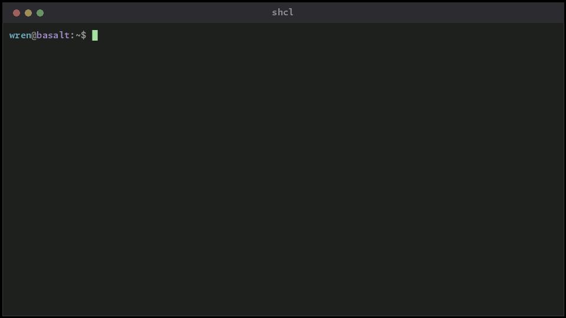

<!-- markdownlint-disable MD007 -- Unordered list indentation -->
<!-- markdownlint-disable MD010 -- hard tabs -->
<!-- markdownlint-disable MD033 -- inline html -->
<!-- markdownlint-disable MD055 -- Table pipe style [Expected: leading_and_trailing; Actual: leading_only; Missing trailing pipe] -->
<!-- markdownlint-disable MD041 -- First line in a file should be a top-level heading -->
<!-- markdownlint-disable MD026 -- Trailing punctuation in heading; the "compares to..." ellipsis is deliberate -->
<div align="center">

[](https://www.rust-lang.org/)
[](https://go.dev/)
[](https://www.python.org/)
[](https://en.cppreference.com/w/c)
[](https://www.gnu.org/software/bash/)

[](https://opensource.org/licenses/MIT)

[](https://github.com/jim-collier/shcl/actions/workflows/ci.yml)
[](https://github.com/jim-collier/shcl/releases)
[](https://crates.io/crates/shcl)
[](https://pypi.org/project/shcl/)
[](https://pkg.go.dev/github.com/jim-collier/shcl/source/go/v2)

<!-- TOC ignore:true -->
# SHCL

**S**imple **H**ierarchical **C**onfig **L**anguage

*Forgiving to write. Predictable to read. The friendliest config API around.*

<!-- width = the gif's own pixel width, so it never renders larger than 1:1; no height attr, so a narrow column can still shrink it without squashing -->


<!-- [Watch the walkthrough](https://www.youtube.com/watch?v=VIDEO_ID) -->

<br />

</div>

> *You get: a complete specification and grammar; one drop-in source file per language; Rust (reference), Go, Python, and C/C++ bindings plus a binary CLI. Bindings are byte-for-byte identical. Thin Bash and PowerShell wrappers sit over the CLI. MIT License.*

<!-- TOC ignore:true -->
## Table of contents

<!-- TOC -->

- [The problem](#the-problem)
- [What SHCL does about it](#what-shcl-does-about-it)
- [How it compares to...](#how-it-compares-to)
	- [Config languages - JSON, YAML, TOML, XML](#config-languages---json-yaml-toml-xml)
	- [Performance comparison benchmarks](#performance-comparison-benchmarks)
		- [Application config](#application-config)
		- [Schema definition](#schema-definition)
		- [Unrealistic stress test](#unrealistic-stress-test)
	- [DDL languages - Pkl, CUE, Dhall](#ddl-languages---pkl-cue-dhall)
	- [When SHCL is the wrong choice](#when-shcl-is-the-wrong-choice)
- [Features](#features)
- [SHCL is used by multiple projects](#shcl-is-used-by-multiple-projects)
- [What a .shcl file looks like](#what-a-shcl-file-looks-like)
- [Installation](#installation)
	- [Language packages](#language-packages)
		- [Cargo](#cargo)
		- [Go module](#go-module)
		- [PyPI](#pypi)
		- [C and C++](#c-and-c)
	- [Other installation options](#other-installation-options)
		- [OS-level packages and installers](#os-level-packages-and-installers)
			- [Debian](#debian)
			- [Fedora, RHEL, openSUSE](#fedora-rhel-opensuse)
			- [Windows](#windows)
		- [Scripted installation direct from web - dev or stable](#scripted-installation-direct-from-web---dev-or-stable)
			- [Linux and WSL](#linux-and-wsl)
			- [Windows PowerShell](#windows-powershell)
		- [DIY install](#diy-install)
- [Using the CLI](#using-the-cli)
- [Example use-cases in your code](#example-use-cases-in-your-code)
	- [Rust](#rust)
	- [Go](#go)
	- [Python](#python)
	- [Zig](#zig)
	- [C, C++](#c-c)
	- [Bash](#bash)
	- [PowerShell](#powershell)
	- [What saving does](#what-saving-does)
- [Set up a development environment](#set-up-a-development-environment)
- [Docs](#docs)
- [Contributing and support](#contributing-and-support)
- [Legal stuff](#legal-stuff)

<!-- /TOC -->

## The problem

You have probably lived some version of this:

- A whole service refused to start because one line of config had a typo.

- YAML turned `country: NO` into `false`. (Norway. It really does that.)

- JSON needed a comment, and JSON does not do comments.
	- Or a trailing comma killed the parse.

- TOML was pleasant right up until the data nested three levels deep.

- You wanted an integer. You got a string, or an exception, or a silent zero you did not notice until production.

- Remember that one project where a complex nested config was stored in XML - that you have PTSD over to this day?

Every mainstream format makes you do the careful work, and punishes the whole file for one mistake.

## What SHCL does about it

SHCL (canonically pronounced "SHiCkLe") flips the burden around. Modern CPU cycles are cheap, even on embedded systems. Brainpower isn't.

So the parser does the hard work - not the person writing the file, and not the programmer consuming the configuration.

SHCL makes a contract:

- Types live in your code, not in the file. The file stores text. You ask for a type when you read a value. Nothing is guessed at parse time, so there is no "Norway problem".

- One broken line never takes down the file. It is skipped with a note. Everything else that can still be loaded safely, is.

- Every convenience read states a fallback at the call site. A missing value cannot sneak in as a silent zero.

- If a person can tell what a line means, the parser can too.

When you do want zero-tolerance rigor: schema validation, plus a strict mode that fails loudly.

## How it compares to...

### Config languages - JSON, YAML, TOML, XML

| | SHCL | JSON | YAML | TOML | XML
| :-- | :-- | :-- | :-- | :-- | :--
| Comments | ✅ | 🚫 | ✅ | ✅ | ✅
| Unquoted strings | ✅ | 🚫 | ✅ But the parser may silently change type | 🚫 | 🚫
| Bad lines don't break the whole thing | ✅ | 🚫 | 🚫 | 🚫 | 🚫
| Who decides a value's type | Your code, at read time | The file | The parser guesses | The file | Your code
| Deep nesting | Indent or dot paths, mixed | Brace pyramids | Indent, whitespace-fragile | `[a.b.c]` headers get old fast | Tag soup
| Multi-line verbatim blocks | Fenced, like Markdown | Escaped strings | Block scalars, with rules to memorize | Multi-line strings | CDATA
| Hand-editable by a non-programmer | ✅ | Risky | Risky | ✅ Mostly | 🚫
| Tells you what it fixed | ✅ Structured diagnostics | 🚫 | 🚫 | 🚫 | 🚫

> *A note on types, because it is the big design difference: JSON and TOML store types in the file, so the author has to get them right. YAML infers types from the text, which is where `NO` becomes `false`. SHCL stores plain text and coerces when **you** ask for a type; the only code that decides a value is an int (for example), is the code that needed an int.*

### Performance comparison benchmarks

SHCL writes the smallest file of the five. But it's slightly (trivially) slower to read - that's due to two conscious tradeoffs - one of them advertised as *the* key differentiating feature:

1. SHCL offloads much of the burden of parsing and datatype-correct formatting from the user and programmer, to the library itself.

2. SHCL is the only one of the five that gives your file back the same way you wrote it.

These test results cover three scenarios, each with the same data in all five config formats, each read by a native Rust library for each format. Columns are ordered fastest to slowest.

#### Application config

This test covers the kind of config a person hand-edits. The test data contains entries for server, logging, database, cache, auth, paths, limits, feature flags, and a banner block.

| Config file       | JSON      | XML   | TOML  | YAML  | SHCL
| :--               | :--       | :--   | :--   | :--   | :--
| File size (KiB)   | 2.2       | 3.0   | 1.7   | 1.7   | **1.6**
| Read time (ms)    | **0.009** | 0.015 | 0.024 | 0.066 | 0.066

Practically nobody chooses a format based on read times that low, except maybe embedded executables measured below a KiB for realtime systems. (And then they wouldn't be using any statically linked libraries anyway.)

#### Schema definition

This test covers 197 table definitions, each with typed columns, nullability, defaults, keys, indexes, and comments.

| Schema file    | JSON    | XML | TOML | YAML | SHCL
| :--            | :--     | :-- | :--  | :--  | :--
| File size (KB) | 431     | 498 | 298  | 322  | **262**
| Read time (ms) | **1.7** | 2.8 | 4.5  | 12.8 | 12.6

Here SHCL is 39% smaller than JSON and 47% smaller than XML, and still reads in under an eightieth of a second. This is the size SHCL is built for: a big file that people still edit by hand.

#### Unrealistic stress test

Far past anything anyone edits by hand: one array of 302,230 records.

| Stress test                | JSON     | XML     | TOML | YAML | SHCL
| :--                        | :--      | :--     | :--  | :--  | :--
| File size (MiB)            | 107      | 160     | 77   | 80   | **67**
| Gzipped (MiB)              | 8.9      | 11.0    | 9.3  | 9.4  | 9.1
| Read time (s)              | **0.62** | 1.02    | 1.74 | 4.20 | 4.78
| Peak memory (GB)           | 2.1      | **1.5** | 3.0  | 3.9  | 1.8
| Keeps your file as written | no       | no      | no   | no   | **yes**

`toml_edit` is the only other parser here that keeps the file contents (e.g. comments), and SHCL uses a quarter of the memory - but at twice the read time.

Every number above comes from one Rust library per format. A slow library and a slow format are not the same thing, so the same files are read again in Python. Most Python parsers are C underneath - `json`, `ElementTree` and PyYAML all C - while SHCL's Python binding is pure Python. That leaves `tomllib`, also pure Python, as the only fair match. In Python, SHCL reads 3.5 times slower than `tomllib`; in Rust, 2.1 times slower than `toml`. Two languages, two separate implementations, the same few-fold gap.

TLDR: If you are moving a lot of machine-generated data over a high-bandwidth connection, use JSON. If you want to save developer and user time (and sanity), use SHCL.

> *How it was measured: [`cicd/utility/comparison/`](cicd/utility/comparison/) writes the same data in all five formats, then reads each file back with its own ecosystem's parser - same compiler, same flags, one process per measurement. Method and caveats are in [design.md](project/design.md#format-comparison); every number, including the other shapes and the Python tier, is in [results.shcl](cicd/utility/comparison/results.shcl).*

### DDL languages - Pkl, CUE, Dhall

These are a different species. They overlap a little with SHCL's power layer, but from the opposite direction: they make the *config file itself* powerful, which is exactly what SHCL avoids.

- **Pkl** (from Apple) is a real language: classes, inheritance, built-in validation. Great when your config genuinely is a program. (And very arguably the winner among these three, depending on your use-case.)

- **CUE** unifies types and values into one thing. Extremely strong validation, and a mental model that takes real time to absorb.

- **Dhall** is functional programming for config: imports, functions, guaranteed termination. Closer to writing Haskell than editing a file.

They are all good at what they do. The shared cost is that once a config file can compute, it can be wrong in ways you have to debug.

SHCL deliberately stays off that cliff. The file stays dumb, and the power moves into the library instead:

- **Schema validation.** A schema is just another SHCL file. `doc.validate(schema)` catches unknown fields, wrong types, and out-of-range values, including the "did you mean `enabled`?" typo case.

- **Layered loading.** `merge(base, over)` folds files in order - defaults, then site, then user, last wins - and the CLI stacks the same way, with repeatable `--layer=FILE` and `--set=PATH=VALUE` overrides on top. That covers most of what imports actually get used for. Environment variables are deliberately left to your program: the env namespace and its naming convention belong to the app, which can map them onto `--set` itself.

- **Generated starter configs.** The schema plus the writer can emit a fully commented, correctly typed starting file.

Your config never needs a debugger, and a non-programmer can still edit it.

### When SHCL is the wrong choice

- You need expressions, functions, or imports inside the file itself. Use Pkl (arguably best), CUE, or Dhall.

- You are serializing machine-to-machine data at high volume. Use JSON or something binary. SHCL is for files that people edit.

## Features

- Hierarchy by indentation or dot-notation (`site[blog.example.com].tls.hsts: off`), freely mixed. Both spell the same tree.

- Values are typed on *read*, not on parse. The file stores text; your code asks for an int.

- Never bails on a whole file over one bad line. Bad lines are skipped or repaired, and the rest still loads. Every diagnostic carries a stable code (`E014`, `V001`), so tooling can match on the code while the prose stays free to improve.

- Every convenience read takes a call-site fallback (`GetIntOr(path, 0)`), so a missing value can't masquerade as a real zero.

- Three strictness levels. Loose, standard, strict: one knob from maximum-forgiving to fail-on-anything.

- Repeated fields are queryable as a set - count them, list them, or fan one read across all of them with `site[*].root` and get a status per slot.

- Full read *and* write. Setters build any missing structure along the path, and saving canonicalizes the file while keeping your comments attached to what they documented.

- A file tier that carries the whole load/save lifecycle, since that is where a config program's bugs actually live: one call to read and parse, a status that separates missing from unreadable from parsed-with-errors, a save through a temp file and a rename that refuses when writing back would delete a line the load could not keep, and a bounded read that hands back the bytes for the program that watches its own file.

- Schema validation, layered loading (defaults, site, user), and commented starter-config generation, all as library features.

- Raw fenced blocks embed anything verbatim: SQL, code, templates, Markdown-style.

- One conformance corpus pins every binding to identical behavior. The Rust reference plus independent Go, C, and Python parsers agree byte-for-byte. A binding is not released until it does.

## SHCL is used by multiple projects

SHCL is in use today - and made further bulletproof - by these projects:

| Project                                                                                    | OSS? | Release status | Used for
| :--                                                                                        | :--: | :--            | :--
| [SilkTerm](https://github.com/jim-collier/silkterm)                                        |  Y   | beta           | Config & UI language
| [Nano-Git DB OSS Edition](https://github.com/jim-collier/nano-git-db)                      |  Y   | beta           | Config & DDL
| [Nano-Git DB Enterprise Edition](https://www.yottacore.com/product/nano-git-db-enterprise) |  Y   | beta           | Config
| [convert-base-v2](https://github.com/jim-collier/convert-base-v2)                          |  Y   | **stable**     | Config
| [TradeClanker](https://www.yottacore.com/product/tradeclanker)                             |  n   | beta           | Config & User's rules

<!--
| [Rapid Photo Downloader Pro](https://github.com/jim-collier/rapid-photo-downloader-pro)    |  Y   | alpha          | Config
| [Nemo Anywhere](https://www.yottacore.com/product/nemo-anywhere)                           |  Y   | beta           | Config
| SlodWorld                                                                                  |  n   | beta           | Config
| [SlodWorld2](https://www.yottacore.com/product/slodworld2)                                 |  n   | beta           | Config
-->

(Most of these are by the same author.)

## What a .shcl file looks like

A small web server - the kind of thing nginx makes you learn a bespoke brace language for. All of this is one valid file: indentation and dotted paths are interchangeable, quoting is only needed when a value contains a reserved character, and messy spacing is fine.

```text
# Flat, TOML-style settings
listen: "0.0.0.0:443"
workers: 4
log-level: warn

# Hierarchy when you need it: one instance per site
site: example.com
	root: /srv/www/example
	Max-Upload-MB : 50
	methods: GET, POST, HEAD
	tls:
		cert: /etc/ssl/example.pem
		hsts: on

# Repeating the field adds another site - arrays of objects
# no syntax to invent
site: blog.example.com
	root: /srv/www/blog

# Dotted paths spell the same tree; add to any instance from anywhere
site[blog.example.com].tls.hsts: off

# Multi-line content goes in a fenced block, kept verbatim
maintenance-page:
	~~~html
	<h1>Down for maintenance - back in five.</h1>
	~~~
```

Field names are case-insensitive. Repeated paths merge. `site` here is not one key but a set of instances (example.com, blog.example.com), each with its own children - arrays of objects without inventing syntax for them.

## Installation

The latest release, `v2.0.0`, has packages, prebuilt CLI binaries, and a checksums file on the [releases page](https://github.com/jim-collier/shcl/releases).

### Language packages

Each binding is published where its own ecosystem looks for it, all under the name `shcl`: [crates.io](https://crates.io/crates/shcl) for Rust, [PyPI](https://pypi.org/project/shcl/) for Python, and the [Go module](https://pkg.go.dev/github.com/jim-collier/shcl/source/go/v2) for Go.

Two of them carry the CLI as well as the library, which is the easiest way to get the binary on a platform with no prebuilt one - macOS and the BSDs included:

#### Cargo

The crate carries the library and the CLI:

```sh
cargo install shcl
```

#### Go module

The module is the library by itself and installs no command, so this is a dependency, not an installation:

```sh
go get github.com/jim-collier/shcl/source/go/v2
```

#### PyPI

The PyPI distribution is the library module by itself and installs no command, so `pip install shcl` is a dependency, not an installation:

```sh
pip install shcl
```

#### C and C++

No registry to target, and none needed: `shcl.h` is a single dependency-free header you vendor. See [C, C++](#c-c) for where to get it and how to build against it.

For version pinning and the dependency line per ecosystem, see [Example use-cases in your code](#example-use-cases-in-your-code).

### Other installation options

#### OS-level packages and installers

The simplest route, if your system has a package manager. Download the `.deb`, `.rpm`, or Windows setup for your architecture (`x86_64` or `arm64`) from the releases page.

Packages put the binary at `/usr/bin/shcl`, and the drop-in sources and shell wrappers under `/usr/share/shcl/`. They also install the man page and the bash and zsh completions where each shell already looks, so `man shcl` and tab completion work with nothing to configure.

##### Debian

```sh
sudo dpkg -i shcl-2.0.0-linux-x86_64.deb
```

##### Fedora, RHEL, openSUSE

```sh
sudo rpm -i shcl-2.0.0-linux-x86_64.rpm
```

##### Windows

Run `shcl-2.0.0-windows-x86_64-setup.exe`. It installs to `C:\Program Files\Shcl`, adds that to `PATH`, and can uninstall itself later.

#### Scripted installation direct from web - dev or stable

Downloads a release, checks its signature, and installs the binary plus the drop-in files and wrappers. Idempotent. It states its plan and asks before touching anything. The default channel is `dev`, which means the newest release including pre-releases. Pass `stable` to take the newest full release only.

Each release includes a `sha256sums.txt` and a detached `.sig` over it, covering every asset - the binary, the packages, and the drop-in payload alike. Both installers carry the release public key and verify that signature *before* reading any checksum out of the file, so replacing a release asset is not enough to get past them. Nothing unverified is installed: a release with no signed drop-in payload gets the binary and a note saying what was skipped. On Linux this needs `openssl`, alongside `curl` or `wget`; there is no install-anyway fallback, so use the [DIY install](#diy-install) route on a machine that lacks it.

Options are `--release <dev|stable>`, `--target <user|system>`, and `--yes` to skip the prompt (`-Release`, `-Target`, `-Yes` on Windows). `--uninstall` (`-Uninstall`) removes what an install of the same target laid down, and nothing else. `--help` (`-Help`) lists them all.

The Linux installer also lays down the man page and the shell completions. It symlinks the man page into the target's own `man1` directory, so `man shcl` works once the install directory is on your `PATH` - man derives its search path from the `bin` directories there. Completions are left under `<install dir>/completions/` for you to enable, and the installer prints the line to paste for each shell: there is no single directory that works everywhere, and writing into the distribution's own is the packages' job, not a tarball installer's.

##### Linux and WSL

```sh
curl -fsSL https://raw.githubusercontent.com/jim-collier/shcl/main/install.bash | bash
```

To pass options on Linux, add them after the pipe:

```sh
curl -fsSL https://raw.githubusercontent.com/jim-collier/shcl/main/install.bash | bash -s -- --target=user
```

##### Windows (PowerShell)

```powershell
irm https://raw.githubusercontent.com/jim-collier/shcl/main/install.ps1 | iex
```

On Windows, `irm | iex` cannot take arguments at all, so use the scriptblock form:

```powershell
& ([scriptblock]::Create((irm https://raw.githubusercontent.com/jim-collier/shcl/main/install.ps1))) -Target user
```

| Target | Linux | Windows
| :-- | :-- | :--
| `system` (default) | `/opt/shcl` plus a `/usr/local/bin/shcl` symlink | `C:\Program Files\Shcl`, added to `PATH`
| `user` | `~/.local/share/shcl` plus a `~/.local/bin/shcl` symlink | `%LOCALAPPDATA%\Programs\Shcl`, added to your `PATH`

A `user` install needs no sudo or elevation.

macOS and the BSDs have no prebuilt binaries yet. Use `cargo install shcl`, a drop-in source file, or build the CLI.

#### DIY install

- **Prebuilt binary**. Grab the `shcl` binary for your platform from the releases page and put it anywhere on your `PATH`. To check it by hand, download the sums file, its `.sig`, and [`shcl-signing.pub`](shcl-signing.pub) from the repo, then verify the signature before the checksum. A checksum out of an unverified sums file proves nothing:

	```sh
	openssl dgst -sha256 -verify shcl-signing.pub \
		-signature shcl-2.0.0-sha256sums.txt.sig shcl-2.0.0-sha256sums.txt
	sha256sum -c --ignore-missing shcl-2.0.0-sha256sums.txt
	```

- **Drop-in source**. Copy one file into your project. No dependency, no build step. Rust `source/rust/src/lib.rs`, Go `source/go/shcl.go`, Python `source/python/shcl.py`, C `source/c/shcl.h`.

- **Build the CLI**. The reference lives in `source/rust/` and has zero dependencies:

	```sh
	cargo build --release --manifest-path source/rust/Cargo.toml
	# binary at source/rust/target/release/shcl
	```

	Release builds are reproducible: on the pinned toolchain in `rust-toolchain.toml`, building a given commit produces a byte-identical binary on any machine, from any directory. So you can build a release tag yourself and check your own binary against the published checksum, rather than taking the download on trust. This holds for all four shipped targets.

	Each other binding builds with its own toolchain (`go build`, a C compiler, a Python interpreter). All of them run the same conformance corpus.

## Using the CLI

Everything the library does, the `shcl` binary does from a shell: typed reads, edits, validation, formatting, and starter-config generation. One dependency-free executable, so it is also a config probe for shell scripts, Makefiles, and CI.

Reads are typed at the call site exactly as they are in code, and a fallback is one option away:

```console
$ shcl get --int server.shcl workers
4

$ shcl get --int --default=8 server.shcl thread-pool     # absent from the file
8

$ shcl get server.shcl 'site[example.com].tls.cert'
/etc/ssl/example.pem
```

Repeated fields are queryable as a set, and `[*]` fans one read across every instance:

```console
$ shcl count server.shcl site
2

$ shcl instances server.shcl site
example.com
blog.example.com

$ shcl get --array --slots server.shcl 'site[*].tls.hsts'
Good	on
Good	off
```

`check` is where the forgiving parser shows its hand. Knock the colon off line 3 of that file, and line 3 is all you lose:

```console
$ shcl check server.shcl
line 3: Error: E014
line 3: Error: malformed line skipped: unexpected '4' after field
failed: 1 diagnostic(s), 1 error(s)

$ shcl get server.shcl log-level     # the rest of the file loaded fine
warn
```

The stable code goes to stdout and the prose to stderr, so a script can match on `E014` without parsing English, and `check` exits 6 when it found errors - enough to gate a build.

Hand it a schema and it validates against that too. A schema is an ordinary `.shcl` file: one `field:` instance per path, constraints written as its children ([the spec](project/spec.md#schema-validation) has the full vocabulary).

```text
field: workers
	type: int
	desc: Worker threads.
	min: 1
	max: 256
	default: 4
	required: yes

field: log-level
	type: string
	desc: How chatty the log is.
	allowed: debug, info, warn, error
	default: warn
```

That catches wrong types, out-of-range numbers, and unknown fields - and for the last one it names the field you probably meant:

```console
$ shcl check --schema=app-schema.shcl app.shcl
line 2: Error: V001
line 2: Error: unknown field 'log-levle'; did you mean 'log-level'?
failed: 1 diagnostic(s), 1 error(s)
```

A broken schema cannot mask a broken config: a fault in the schema itself is reported as its own error (`V090`+), and the constraints that did parse still check the file. The unknown-field sweep keeps running through a broken constraint, since the field is still declared by name; it turns off only when a fault costs a path spelling outright - an unreadable `field:` path, or a mount naming no declared fragment - because only those can turn a declared field into a false unknown.

The same schema, pointed the other way, writes a starting file for your own users - commented, correctly typed, required fields live and optional ones left commented out:

```console
$ shcl init --schema=app-schema.shcl
# Worker threads.
# int, 1-256, required
workers: 4

# How chatty the log is.
# string, one of: debug, info, warn, error
#log-level: warn

#
# This config file format is SHCL.
# "Simple Hierarchical Config Language"
#    Home     https://github.com/jim-collier/shcl
#    Syntax   https://github.com/jim-collier/shcl/blob/main/project/spec.md
#    Legal    SHCL is Copyright © 2026 Jim Collier. License: MIT. No warranty.
#
```

The footer tells whoever opens that file later what it is and where the syntax is written down; `--no-banner` leaves it out. Rounding out the verbs, `fmt` normalizes a file and `set` edits one, both in place with `--write`:

```sh
shcl fmt --write server.shcl
shcl set --write server.shcl --set 'workers=8'
```

An in-place write prints whatever the load found on stderr, and refuses outright when the load dropped a line the rewrite would delete - your typo does not cost you the line above it. `--lossy` is the way to say you meant it.

`shcl help` covers the rest and `man shcl` says the same at more length, `shcl about` names the version, license and project home, and `shcl donate` points at the sponsors page. Tab completion for bash and zsh ships alongside. To drive it from a script with typed helpers instead, there are [Bash](#bash) and [PowerShell](#powershell) wrappers.

## Example use-cases in your code

Bindings are versioned in lockstep, so `2.x` means the same behavior and the same conformance corpus in every language. Each ecosystem's usual compatible-version operator is all you need: it picks up minor and patch releases on its own, and never crosses a major version without you editing the line yourself.

Every binding is one file with no dependencies. You can optionally just copy it out of `source/` and commit it - see [DIY install](#diy-install).

### Rust

- Install: `cargo add shcl`

- Dependency line: `shcl = "2"`

- Note: The Rust crate carries the library and the CLI together. See [Language packages](#language-packages) if the binary is what you are after.

```rust
use shcl::{Document, FileStatus, Status};

// One call reads and parses, and never fails: the document comes back usable
// either way, and the status tells missing apart from unreadable and from
// parsed-with-errors - three cases a hand-written load path tends to blur.
let (mut doc, file_status) = Document::load_file("server.shcl");
if file_status == FileStatus::NotFound {
	println!("no config yet - starting from defaults");
}

// Typed read, with a fallback if the path is missing
let workers = doc.get_int("workers").unwrap_or(4);
let root = doc.get_string("site[example.com].root").unwrap_or_default();

// Or ask why a read failed, when the difference matters
match doc.get_int("site[example.com].max-upload-mb") {
	Ok(mb) => println!("{mb} MB"),
	Err(Status::NotFound) => println!("not configured"),
	Err(other) => println!("unusable: {other:?}"),
}

// Writes create what they need to: this adds a site and a nested block.
// Each one reports whether it applied - a path that cannot be written writes
// nothing at all rather than half of it - and the setters are `#[must_use]`,
// so that answer cannot go missing by accident.
if !doc.set_int("workers", workers * 2) {
	eprintln!("workers: {:?}", doc.write_reason("workers"));
}
if !doc.set_bool("site[example.com].tls.hsts", true) {
	eprintln!("hsts: {:?}", doc.write_reason("site[example.com].tls.hsts"));
}
if !doc.set_string("site[blog.example.com].root", "/srv/www/blog") {
	eprintln!("blog root: {:?}", doc.write_reason("site[blog.example.com].root"));
}

// Writes through a temp file and a rename, so an interrupted save cannot
// truncate the config - and refuses outright if the load dropped a line this
// write would delete (save_file_lossy is the override).
doc.save_file("server.shcl")?;
```

### Go

- Install the module: `go get github.com/jim-collier/shcl/source/go/v2`

- Dependency line: `require github.com/jim-collier/shcl/source/go/v2 v2.0.0`

- Notes: Go keeps its module in a subdirectory, so the import path ends in `/source/go` and the module's own tags carry a matching `source/go/` prefix. From 2.0 the major goes in the path too, as Go requires, so the import ends `/source/go/v2` and `go get -u` tracks `2.x` without ever crossing to a 3.x. A 1.x consumer keeps working on the old path until it edits the import.

```go
import shcl "github.com/jim-collier/shcl/source/go/v2"

// One call reads and parses, and never fails: the document comes back usable
// either way, and the status tells missing apart from unreadable and from
// parsed-with-errors - three cases a hand-written load path tends to blur.
doc, fileStatus := shcl.LoadFile("server.shcl")
if fileStatus == shcl.FileNotFound {
	fmt.Println("no config yet - starting from defaults")
}

workers := doc.GetIntOr("workers", 4)
root := doc.GetStringOr("site[example.com].root", "")

if mb, st := doc.GetInt("site[example.com].max-upload-mb"); st == shcl.Good {
	fmt.Println(mb, "MB")
} else {
	fmt.Println("unusable:", st)
}

// A setter reports whether the write applied: a path that cannot be written
// writes nothing at all rather than half of it, and WriteReason names which of
// the five reasons it hit.
doc.SetInt("workers", workers*2)
doc.SetBool("site[example.com].tls.hsts", true)
if !doc.SetString("site[blog.example.com].root", "/srv/www/blog") {
	fmt.Println("blog root:", doc.WriteReason("site[blog.example.com].root"))
}

// Writes through a temp file and a rename, so an interrupted save cannot
// truncate the config - and refuses outright if the load dropped a line this
// write would delete (SaveFileLossy is the override).
if err := doc.SaveFile("server.shcl"); err != nil {
	log.Fatal(err)
}
```

### Python

- Install: `pip install shcl`

- Dependency line: `shcl~=2.0`

- Note: The PyPI distribution is the library module by itself. Installing it does not put a `shcl` command on your `PATH`.
	- If you want the CLI too, get it from a package or an installer.

```python
import shcl

# One call reads and parses, and never fails: the document comes back usable
# either way, and the status tells missing apart from unreadable and from
# parsed-with-errors - three cases a hand-written load path tends to blur.
doc, file_status = shcl.Document.load_file("server.shcl")
if file_status is shcl.FileStatus.NotFound:
	print("no config yet - starting from defaults")

workers = doc.get_int("workers", default=4)
root = doc.get_string("site[example.com].root", default="")

read = doc.read_int("site[example.com].max-upload-mb")
if read.status is not shcl.Status.Good:
	print("unusable:", read.status)

# A setter reports whether the write applied: a path that cannot be written
# writes nothing at all rather than half of it, and write_reason names which of
# the five reasons it hit.
doc.set_int("workers", workers * 2)
doc.set_bool("site[example.com].tls.hsts", True)
if not doc.set_string("site[blog.example.com].root", "/srv/www/blog"):
	print("blog root:", doc.write_reason("site[blog.example.com].root"))

# Writes through a temp file and a rename, so an interrupted save cannot
# truncate the config - and raises SaveRefused if the load dropped a line this
# write would delete (save_file_lossy is the override).
doc.save_file("server.shcl")
```

### Zig

Zig needs no binding of its own - it consumes the C header directly. `@cImport` takes the declarations, one C file carries the implementation, and thin wrappers let Zig slices supply the pointer-and-length pairs the C API wants:

```zig
const std = @import("std");
const c = @cImport(@cInclude("shcl.h"));

// The C API takes (pointer, length) paths; a Zig slice already carries both.
fn getInt(doc: ?*c.shcl_doc, path: []const u8, def: i64) i64 {
	return c.shcl_get_int(doc, path.ptr, path.len, def);
}
fn setInt(doc: ?*c.shcl_doc, path: []const u8, v: i64) bool {
	return c.shcl_set_int(doc, path.ptr, path.len, v) != 0;
}
fn setBool(doc: ?*c.shcl_doc, path: []const u8, v: bool) bool {
	return c.shcl_set_bool(doc, path.ptr, path.len, @intFromBool(v)) != 0;
}
fn setString(doc: ?*c.shcl_doc, path: []const u8, v: []const u8) bool {
	return c.shcl_set_string(doc, path.ptr, path.len, v.ptr, v.len) != 0;
}
fn readString(doc: ?*c.shcl_doc, path: []const u8) c.shcl_read_str {
	return c.shcl_read_string(doc, path.ptr, path.len);
}

// The C file tier loads and saves, so no Zig file IO is involved
var st: c.shcl_file_status = undefined;
const doc = c.shcl_load_file("server.shcl", &st);
defer c.shcl_free(doc);

const workers = getInt(doc, "workers", 4);

const root = readString(doc, "site[example.com].root");
if (root.status == c.SHCL_GOOD)
	std.debug.print("{s}\n", .{root.value.p[0..root.value.n]});

_ = setInt(doc, "workers", workers * 2);
_ = setBool(doc, "site[example.com].tls.hsts", true);
_ = setString(doc, "site[blog.example.com].root", "/srv/www/blog");

_ = c.shcl_save_file(doc, "server.shcl");
```

Alongside it, an `impl.c` of two lines - `#define SHCL_IMPLEMENTATION`, then `#include "shcl.h"` - and build with `zig build-exe main.zig impl.c -lc -lm -I.`. Letting the C file tier do the loading and saving keeps Zig's own standard library out of it, which matters here because that library still moves between releases while this interop does not; checked on 0.16.

### C, C++

C and C++ have no registry worth targeting. `shcl.h` is a single dependency-free header: copy it into your tree from a release tag and pin that tag, or take it from an installed package under `/usr/share/shcl/code/`. Define `SHCL_IMPLEMENTATION` in exactly one translation unit, and link `-lm`. C++ callers can add `shcl.hpp` alongside it for the typed veneer.

- Install: vendor `shcl.h`

- Dependency line: pin the release tag

```c
#define SHCL_IMPLEMENTATION   // in exactly one translation unit
#include "shcl.h"

#define P(s) s, strlen(s)     // paths take a pointer and a length, not a NUL terminator

// Reads and parses in one call, and never fails: the document comes back
// usable either way, and the status tells missing apart from unreadable and
// from parsed-with-errors. (shcl_parse takes text you already hold.)
shcl_file_status st;
shcl_doc *doc = shcl_load_file("server.shcl", &st);
if (st == SHCL_FILE_NOT_FOUND)
	puts("no config yet - starting from defaults");

int64_t workers = shcl_get_int(doc, P("workers"), 4);

// Strings keep the status tier, so missing and empty stay distinguishable
shcl_read_str root = shcl_read_string(doc, P("site[example.com].root"));
if (root.status == SHCL_GOOD)
	printf("%.*s\n", (int)root.value.n, root.value.p);

// A setter reports whether the write applied: a path that cannot be written
// writes nothing at all rather than half of it, and shcl_write_reason_ names
// which of the five reasons it hit (SHCL_W_WILDCARD here, say).
shcl_set_int(doc, P("workers"), workers * 2);
shcl_set_bool(doc, P("site[example.com].tls.hsts"), 1);
if (!shcl_set_string(doc, P("site[blog.example.com].root"), P("/srv/www/blog")))
	fprintf(stderr, "blog root: reason %d\n", shcl_write_reason_(doc, P("site[blog.example.com].root")));

// Writes through a temp file and a rename, so an interrupted save cannot
// truncate the config. SHCL_SAVE_REFUSED means the load dropped a line this
// write would delete; shcl_save_file_lossy is the override.
if (shcl_save_file(doc, "server.shcl") != SHCL_SAVE_OK)
	fprintf(stderr, "could not save\n");

shcl_free(doc);   // frees the document and everything handed out from it
```

The C binding uses `round()`, so link the math library - `cc -std=c11 -O2 ex.c -o ex -lm`. There are no per-object frees: reads hand back pointers into the document's arena, and the single `shcl_free` releases all of it, so anything you need afterwards must be copied out first. The file calls are an optional companion: `-DSHCL_NO_FILE_IO` compiles them out for an embedded target, leaving `shcl_parse` and `shcl_to_canonical` to work on text you hold yourself.

### Bash

The shell wrappers are not parsers; they wrap the CLI, which is why they inherit its conformance for free. Source one and you get typed sugar over the same commands:

- Install: install the CLI, source the wrapper

- Dependency line: n/a - it wraps the CLI

```bash
source shcl.bash

workers=$(shcl_int --default=4 server.shcl workers)
root=$(shcl_get --default='' server.shcl 'site[example.com].root')

# Repeatable, applied in order; --write rewrites the file in place.
shcl set --write server.shcl \
    --set "workers=$((workers * 2))" \
    --set 'site[example.com].tls.hsts=true' \
    --set-literal 'cluster.hosts=a.example.com, b.example.com'
```

The two spellings differ in how the value is read. `--set` takes **data**: its type follows the text, so `workers=8` writes an integer, but a comma in it is content - `hosts=a, b` would store one quoted string. `--set-literal` takes **value syntax**, the way a file spells it, so that same text writes a two-element array. Reach for it whenever the value is not a plain scalar.

Raw blocks, set-only-if-absent and removal have no option form; those go in as a write-ops script on stdin, one op per line, fields separated by a literal tab:

```bash
shcl set --write server.shcl <<OPS
remove	site[old.example.com]
raw	motd		Welcome.
OPS
```

### PowerShell

Dot-source it for the same helper names:

```powershell
. ./shcl.ps1

$workers = [int](shcl_int --default=4 server.shcl workers)
$root    = shcl_get --default='' server.shcl 'site[example.com].root'

shcl set --write server.shcl `
         --set "workers=$($workers * 2)" `
         --set 'site[example.com].tls.hsts=true' `
         --set-literal 'cluster.hosts=a.example.com, b.example.com'
```

The op-script form works here too - the sourced `shcl` forwards pipeline input to the binary:

```powershell
$ops = "remove`tsite[old.example.com]",
       "raw`tmotd`t`tWelcome."
$ops | shcl set --write server.shcl
```

### What saving does

Three behaviors of the write half are easy to miss, and they are the same in every binding.

Setters build whatever is missing along the path, so the `tls.hsts` and `blog.example.com` lines in the examples above arrive as a nested block and a new site instance without you assembling either.

And saving rewrites the file in canonical form - spacing normalized, field names lowercased, the dotted `site[blog.example.com].tls.hsts` line folded into the block form it was always spelling - while **keeping your comments** attached to whatever they documented, including the one that travels with that folded line:

```text
# Flat, TOML-style settings
listen: "0.0.0.0:443"
workers: 8
log-level: warn

# Hierarchy when you need it: one instance per site
site: example.com
	root: /srv/www/example
	max-upload-mb: 50
	methods: GET, POST, HEAD
	tls:
		cert: /etc/ssl/example.pem
		hsts: true

# Repeating the field adds another site - arrays of objects
# no syntax to invent
site: blog.example.com
	root: /srv/www/blog
	tls:

		# Dotted paths spell the same tree; add to any instance from anywhere
		hsts: off

# Multi-line content goes in a fenced block, kept verbatim
maintenance-page:
	~~~html
	<h1>Down for maintenance - back in five.</h1>
	~~~
```

That is the whole file after the edits, not an excerpt - a formatter that can survive a round trip through an editing tool is the point.

And the save protects the file it is overwriting. It goes through a temp file in the same directory plus a rename, so an interrupted save cannot leave a truncated config behind, and a linked-in config is written through rather than replaced. It also refuses when the load dropped something the write would delete. A line the parser cannot read at all is kept verbatim and survives the save untouched, but a line it could read and not place - a stray indent, an impossible selector - has no safe spelling to re-emit, so it counts into `lost_count()` and the save stops rather than quietly dropping a line somebody typed. `save_file_lossy` is there for when deleting it is what you actually want, so it is always a stated choice.

A setter returns failure - `false`, or `0` in C - when a path cannot be written at all. Wildcards are the usual case, since those are query-only. Nothing is half-written, and `write_reason(path)` says which of the five reasons applied. Worth checking rather than assuming: an ignored failure means the save that follows writes a config missing the edit, and reports success doing it. In Rust the setters are `#[must_use]`, so dropping the answer is a compile warning.

One read-side companion belongs with this: canonical output lowercases field names, and `authored_name(path)` hands back the spelling the author actually used. It is what you want in a message about their file - reporting `Max-Upload-MB` as `max-upload-mb` reads like a different setting to the person who wrote it.

## Set up a development environment

`install-dev.bash` clones the repo, installs the toolchains and linters the pipeline gates on as far as it can without sudo, and prints the package-manager hint for anything left over. It states its plan first:

```sh
curl -fsSL https://raw.githubusercontent.com/jim-collier/shcl/main/install-dev.bash | bash
```

Linux and macOS; on Windows, use WSL, since the pipeline is bash. Then, from the clone:

```sh
cicd/cicd.bash --ci
```

`--ci` is the whole gate: format check, build, lint, tests, and the cross-binding differential. It is the same thing GitHub runs, so green locally means green upstream.

[`contributing.md`](contributing.md) has the full list - every toolchain and linter with its install command, the per-binding test commands, the extra tools a full cross-and-package run wants, and how to add a conformance case.

## Docs

- [`project/spec.md`](project/spec.md): the full language spec. Terminology, types, coercion, the read API, raw blocks, strictness levels.

- [`project/grammar.abnf`](project/grammar.abnf): the formal grammar.

- [`project/design.md`](project/design.md): the why behind the decisions.

- [`contributing.md`](contributing.md): how to help.

- [`style-guide.md`](style-guide.md): coding and prose style. The bindings deliberately mirror the reference's structure over per-language idiom, so they stay byte-for-byte in sync.

Generated API reference, per binding: [docs.rs](https://docs.rs/shcl) for Rust, [pkg.go.dev](https://pkg.go.dev/github.com/jim-collier/shcl/source/go/v2) for Go.

## Contributing and support

This product has to be bulletproof, so help is welcome. Bug reports, spec edge cases, and new-language bindings all count. See [`contributing.md`](contributing.md) to get started.

If SHCL helps but code and issue reports aren't your thing, a star or a mention still helps other people find it - and if it is saving you real time, [sponsorship](https://github.com/sponsors/jim-collier) is welcome.

## Legal stuff

> Copyright © 2026 Jim Collier (CryptogID: ѳ6ᴚ℈𐀘𐇦ɛ𐊁¥Mﾏb϶Δ𐌞)<br />
> Licensed under the [MIT License](https://mit-license.org/)<br />
> SPDX-License-Identifier: `MIT`<br />
> No warranty.<br />
> SHCL™ is a [trademark](trademark.md) of Jim Collier. The name means it passes the conformance corpus.
